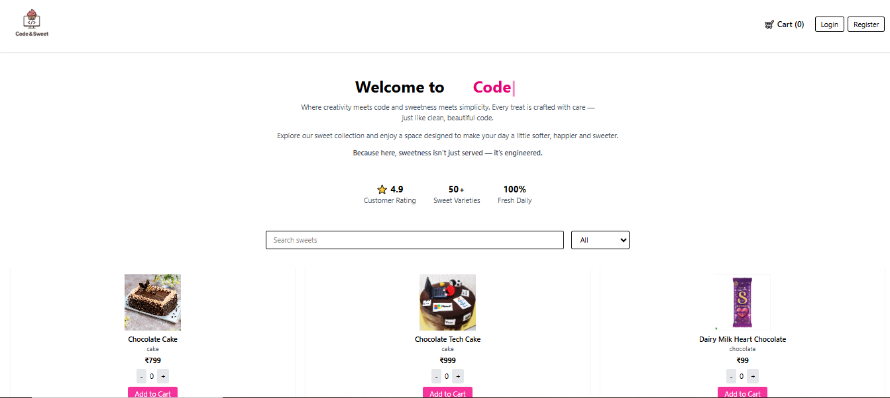
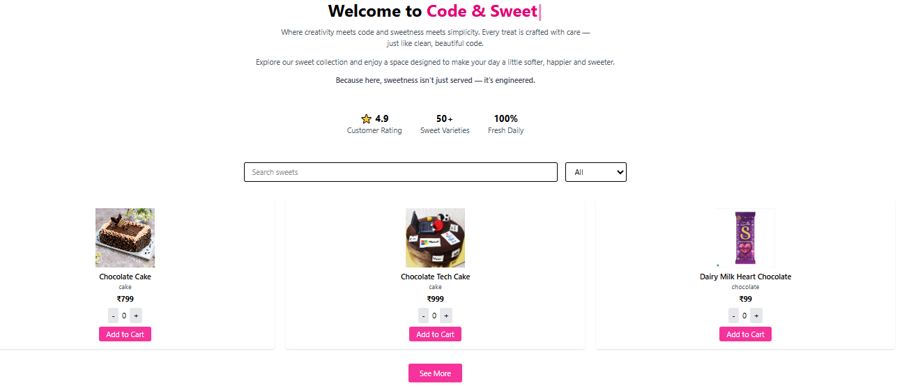
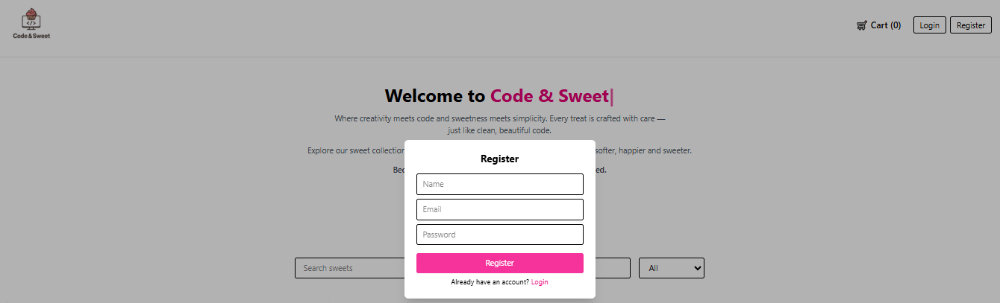

# 🍰 Cacao & Confection (CodeandSweet)

Cacao & Confection is a premium, full-stack e-commerce web application built using the MERN stack. Designed with high-end dark-mode aesthetics, glassmorphism, dynamic typing effects, and sleek animations, the application delivers a bespoke digital storefront experience for gourmet sweet connoisseurs.

It enables users to browse catalog items, search & filter treats by categories, manage local/database cart inventories, place order ledgers, and view their purchase history. It also features a fully-equipped Admin Dashboard for managing products and analyzing sales metrics.

---

## 🚀 Tech Stack

### Frontend
- **Framework & Build Tool:** React.js (Vite)
- **Styling:** Tailwind CSS & Custom CSS Utilities
- **Animations:** Framer Motion
- **Architecture:** React Hooks & API Request Layer

### Backend
- **Framework:** Node.js & Express.js (ES Modules)
- **Database:** MongoDB & Mongoose
- **Authentication:** JSON Web Tokens (JWT) & bcrypt.js (Password Hashing)
- **Storage:** Local Storage (`/uploads`) & Cloudinary Integration

---

## 🌐 Live Links
- **Frontend URL:** [https://codeand-sweet.vercel.app/](https://codeand-sweet.vercel.app/)
- **Backend API:** [https://codeandsweet.onrender.com/api](https://codeandsweet.onrender.com/api)

---

## 📂 Project Structure

```text
CodeandSweet/
├── backend/
│   ├── app.js             # Express application initialization & middleware
│   ├── server.js          # DB Connection & Node Server startup
│   ├── routes/            # Routes (Auth, Sweets, Cart, Transactions)
│   ├── models/            # Schema Models (User, Sweet, Cart, Transaction)
│   └── package.json
│
├── frontend/
│   ├── src/
│   │   ├── components/    # Reusable components (Header, Hero, ProductCard, Stats, AdminPanel...)
│   │   ├── pages/         # Page templates (Home)
│   │   ├── api/           # Centralized API requests
│   │   ├── assets/        # Media & Logo assets
│   │   ├── App.jsx        # Root application container
│   │   └── main.jsx       # Entry point
│   ├── index.html
│   └── package.json
│
└── README.md
```

---

## ✨ Features

### User Experience
- **Premium Interface:** High-end, responsive dark mode layout with custom scrollbars, gold gradients, hover effects, and typing micro-animations.
- **Dynamic Catalog:** Fluid search and category pills matching confections instantly.
- **Cart Lifecycle:** Fully persistent guest cart locally or logged-in cart synchronized to MongoDB.
- **Order Tracking:** Detailed transaction checkouts and order history ledger.
- **Responsive Layout:** Optimized from the ground up for phone, tablet, and laptop screens.

### Admin Dashboard
- **Product Management:** Interactive CRUD module to add new sweets, modify details, upload recipe photos, or restock item inventories.
- **Sales Intelligence:** Live KPI summary cards monitoring gross revenue, total transaction counts, and best-selling flavors.
- **Order Ledger:** Detailed table tracking customer metadata, order items, and shipping addresses.

---

## 🛠 Installation & Setup

### 1️⃣ Clone the Repository
```bash
git clone https://github.com/Subham5778/CodeandSweet.git
cd CodeandSweet
```

### 2️⃣ Backend Setup
```bash
cd backend
npm install
npm run dev
```
*Note: Ensure you configure your `.env` variables containing your `MONGO_URL`, `JWT_SECRET`, and port configurations.*

### 3️⃣ Frontend Setup
```bash
cd ../frontend
npm install
npm run dev
```

---

## 📸 Screenshots

Here is a preview of the application interfaces:

### Homepage Storefront


### Cart Inventory & Checkout


### User Profile Management


### Admin Sales & Catalog Panel


---

## 🧑‍💻 Author
**Subham Kumar**  
*B.Tech CSE | Full Stack Developer*
